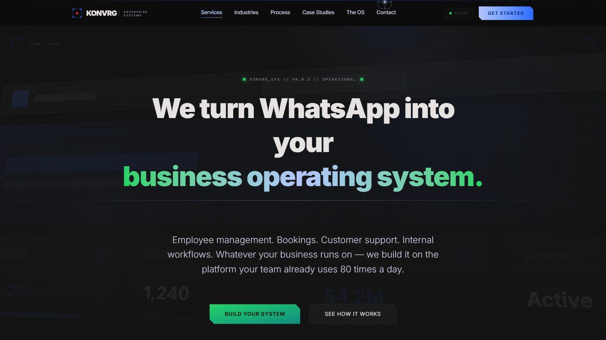

# Konvrg

Marketing site for Konvrg, which builds custom operational systems on WhatsApp for South African
businesses.

The pitch: most small businesses here already run on WhatsApp informally — bookings in a chat,
leave requests to a manager's personal number, stock counts in a group. Konvrg builds the system
around that instead of asking everyone to move to software they won't open.

## What the site covers

- **WhatsApp systems** — operational workflows built around a team's existing processes and data.
- **AI in chat** — assistants that handle bookings, HR requests and customer support inside the
  thread.
- **Data integration** — connecting WhatsApp to spreadsheets and existing tools without migrating
  the data anywhere.
- **Live dashboards** — the manager's view across whatever is running in chat.

## Stack

Next.js 16 (App Router), React 19, TypeScript, Tailwind CSS 4. Vercel Blob for assets. Deployed on
Vercel.

## Status

Live.

---

Source is private — this repo is the write-up. [Shaun Madondo](https://github.com/TheC0deJunkie) · Durban, KwaZulu-Natal.
